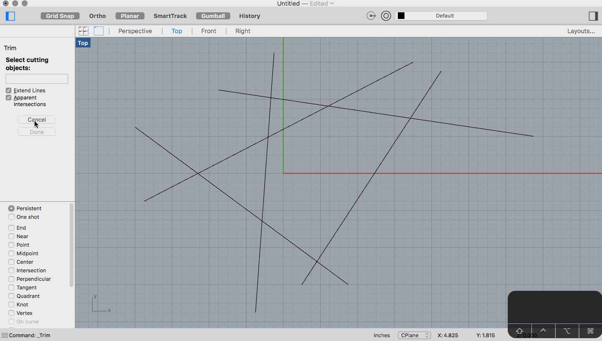
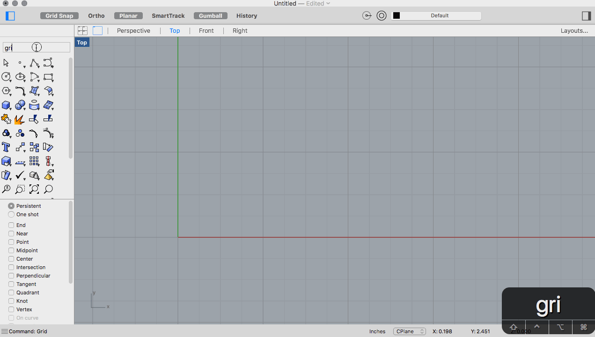
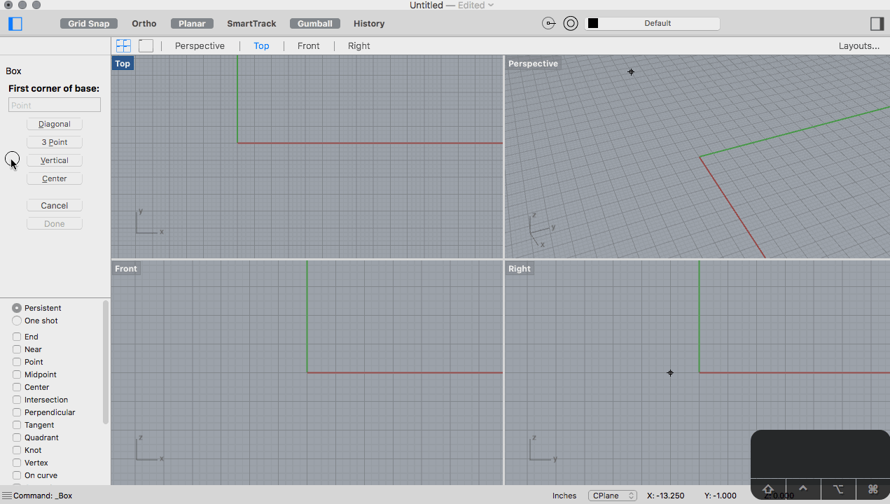

### Rhino 5 Commands
Rhinoceros 3D can be very opaque to beginners, as you often need to know the name of the command, or to have memorized its inscrutable icon, before you can use it! This guide will contain brief videos of useful commands to help get your modeling started.

##### Snaps
- Grid Snap

- End Snap

- Point Snap

- Midpoint Snap

- Center Snap

- Intersection Snap

- Quadrant Snap

##### General Operations
- Inclusive vs Exclusive Selections
- Gumball Manipulations

- Drag Copy (Press, and don't hold, Alt/Opt key while dragging)

- `Trim`

- `Move`

- `Grid`

##### Vectors
- `Point` and `Points`

##### Curves
[Introduction to Curve Drawing](http://docs.mcneel.com/rhino/5/help/en-us/index.htm#seealso/sak_curve.htm)

- `Line`

- `Polyline`

- `Rectangle`

- `Rectangle` (3 Point)

- `Circle` (Radius and Diameter)

- `Curve` (Control Points)

##### Curve Manipulation
- `Fillet`

- `Chamfer`

- `FilletCorners`

##### Dimensioning
- `Dim` Linear Dimensioning

##### 3D Primitives
- Box

##### Solid Modeling
- `ExtrudeCrv`

