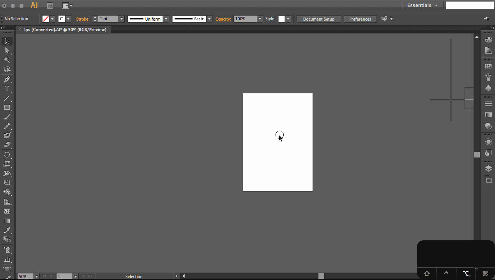
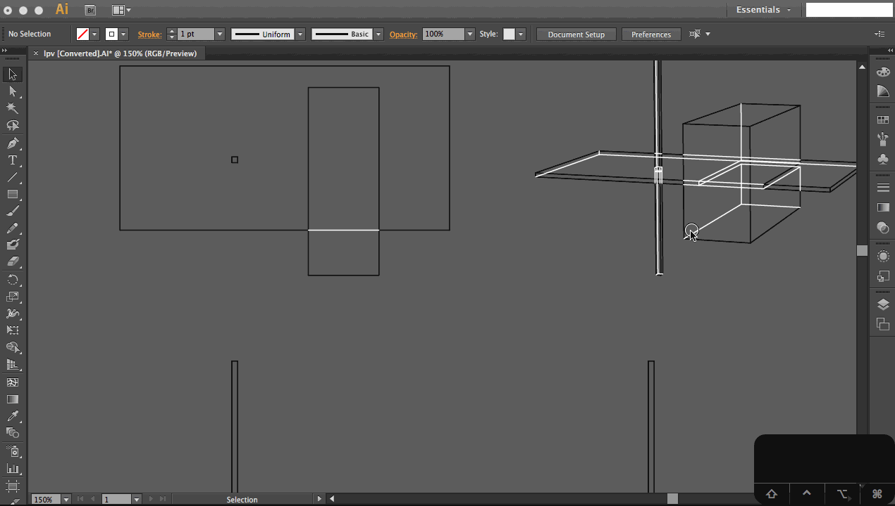

### Make2D Orthographic and Perspective Lineart to Illustrator

- Create a model

- Run `make2d` to produce lineart

- Dimension with `dim` if needed

- Export the model to an AI file

- Edit the artboard to tabloid

 
- Change the stroke color (a step is invisible: use `Select->Same->Appearance` to grab all hidden lines)

- Add some text and dimensions to the page, as well as important identifying text.

